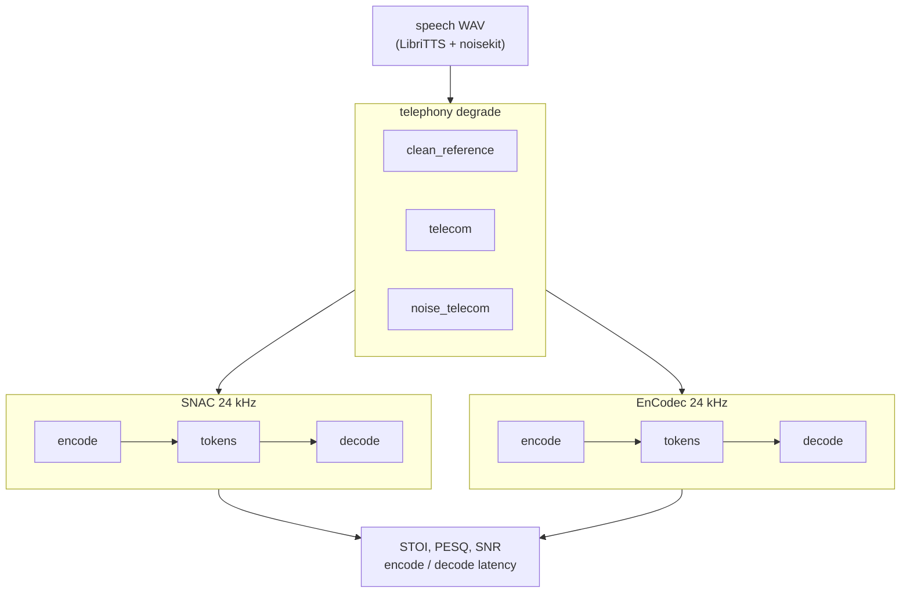

# telephony-codec-bench

After speech goes through a phone channel (narrowband, μ-law, background noise), how much comes back if you run a neural codec round-trip?

This repo compares **SNAC** (multi-scale tokens, the family Bland and others use for LLM-TTS) against **EnCodec** (Meta's RVQ baseline). The benchmark reports STOI, PESQ, SNR, and encode/decode latency.

[](https://colab.research.google.com/github/ST-48-1240162/telephony-codec-bench/blob/main/docs/Telephony_Codec_Bench.ipynb)

Notebook: [docs/Telephony_Codec_Bench.ipynb](docs/Telephony_Codec_Bench.ipynb) / step-by-step: [docs/COLAB.md](docs/COLAB.md)

## What runs where

| What | Where |
|------|-------|
| LibriTTS + noisekit telephony WAVs | Colab T4 (~2-3 h for 200 utterances × 3 presets) |
| SNAC vs EnCodec numbers | Colab T4 (or any CUDA box) |

## Install

**Colab:** use the notebook install cell (pinned [`docs/colab-requirements.txt`](docs/colab-requirements.txt), do not `pip install torch` from PyPI).

**Local GPU:** install a matched `torch` / `torchaudio` stack first, then:

```sh
python3.11 -m venv ~/.venvs/telephony-codec-bench
~/.venvs/telephony-codec-bench/bin/pip install torch torchaudio --index-url https://download.pytorch.org/whl/cu124
~/.venvs/telephony-codec-bench/bin/pip install -e '/path/to/telephony-codec-bench[bench]'
python scripts/verify_colab_env.py
```

Use a normal Linux filesystem (exFAT drives often break `.venv` symlinks).

## Full benchmark

```sh
pip install -e '.[bench]'
python scripts/run_benchmark.py \
  --data-dir ./data/telephony_speech \
  --device cuda \
  --out reports/benchmark.json
```

Generate `./data/telephony_speech` with noisekit first (cells in the Colab notebook).

## Pipeline



Local `degrade.py` uses a simple 8 kHz bandpass + μ-law + upsample. Colab runs use [noisekit](https://github.com/karamouche/noisekit) `telecom` presets for reproducible benchmark numbers.

Codecs: [SNAC](https://github.com/hubertsiuzdak/snac) and EnCodec via HuggingFace `facebook/encodec_24khz`.

## References

1. [SNAC (2024)](https://arxiv.org/abs/2410.14411)
2. [EnCodec (2022)](https://arxiv.org/abs/2210.13438)
3. [Bland on SNAC + LLM TTS](https://www.bland.ai/blog/new-tts-announcement)
4. [noisekit](https://github.com/karamouche/noisekit)
5. [Codec-SUPERB](https://github.com/voidful/Codec-SUPERB)

## License

GPL-3.0-or-later; see [LICENSE](LICENSE).
