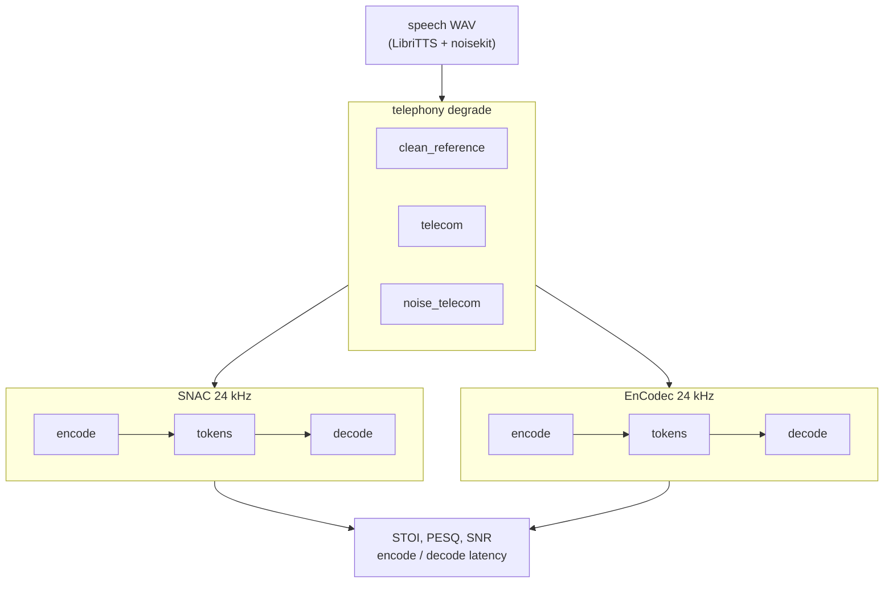

# telephony-codec-bench

Phone audio is narrowband, companded, and often noisy. This repo asks a simple question: if you run that speech through a neural codec and back out, how much is left?

We compare **SNAC** (multi-scale tokens, the kind used in LLM-TTS stacks like Bland) with **EnCodec** (Meta's RVQ baseline). You get STOI, PESQ, SNR, and encode/decode timing.

[](https://colab.research.google.com/github/ST-48-1240162/telephony-codec-bench/blob/main/docs/Telephony_Codec_Bench.ipynb)

**Notebook:** [docs/Telephony_Codec_Bench.ipynb](docs/Telephony_Codec_Bench.ipynb)  
**Walkthrough:** [docs/COLAB.md](docs/COLAB.md)

## What runs where

| Step | Where |
|------|-------|
| Build telephony WAVs (FLEURS + noisekit) | Colab T4, about 2-3 h for 200 utterances × 3 presets |
| SNAC vs EnCodec benchmark | Colab T4 or any CUDA machine |

## Install

**Colab:** run the notebook install cell. Pins live in [`docs/colab-requirements.txt`](docs/colab-requirements.txt). Do not `pip install torch` from PyPI on Colab.

**Local GPU:** install a matching `torch` / `torchaudio` pair first, then:

```sh
python3.11 -m venv ~/.venvs/telephony-codec-bench
~/.venvs/telephony-codec-bench/bin/pip install torch torchaudio --index-url https://download.pytorch.org/whl/cu124
~/.venvs/telephony-codec-bench/bin/pip install -e '/path/to/telephony-codec-bench[bench]'
python scripts/verify_colab_env.py
```

Use a normal Linux filesystem. exFAT drives often break `.venv` symlinks.

## Full benchmark

```sh
pip install -e '.[bench]'
python scripts/run_benchmark.py \
  --data-dir ./data/telephony_speech \
  --device cuda \
  --out reports/benchmark.json
```

Generate `./data/telephony_speech` with noisekit first (see the Colab notebook).

## Pipeline



For a quick local test, `degrade.py` applies a simple 8 kHz bandpass, μ-law, and upsample. Full benchmark runs use [noisekit](https://github.com/karamouche/noisekit) `telecom` presets so numbers stay reproducible.

Codecs: [SNAC](https://github.com/hubertsiuzdak/snac) and EnCodec via HuggingFace `facebook/encodec_24khz`.

## References

1. [SNAC (2024)](https://arxiv.org/abs/2410.14411)
2. [EnCodec (2022)](https://arxiv.org/abs/2210.13438)
3. [Bland on SNAC + LLM TTS](https://www.bland.ai/blog/new-tts-announcement)
4. [noisekit](https://github.com/karamouche/noisekit)
5. [Codec-SUPERB](https://github.com/voidful/Codec-SUPERB)

## License

GPL-3.0-or-later. See [LICENSE](LICENSE).
