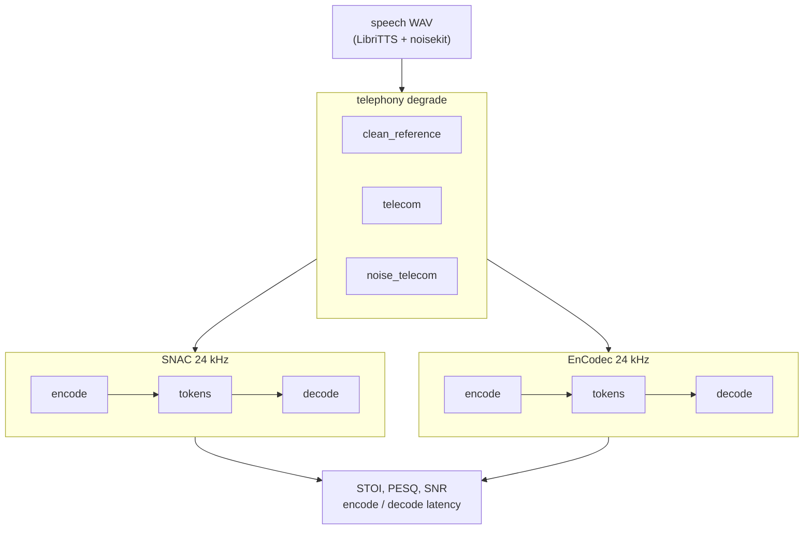

# telephony-codec-bench

Phone audio is narrowband, companded, and often noisy. This repo asks a simple question: if you run that speech through a neural codec and back out, how much is left?

We compare **SNAC** (multi-scale tokens, the kind used in LLM-TTS stacks like Bland) with **EnCodec** (Meta's RVQ baseline). You get STOI, PESQ, SNR, and encode/decode timing.

[](https://colab.research.google.com/github/ST-48-1240162/telephony-codec-bench/blob/main/docs/Telephony_Codec_Bench.ipynb)

**Notebook:** [docs/Telephony_Codec_Bench.ipynb](docs/Telephony_Codec_Bench.ipynb)  
**Walkthrough:** [docs/COLAB.md](docs/COLAB.md)

## What runs where

| Step | Where |
|------|-------|
| Build telephony WAVs (FLEURS + noisekit) | Colab T4, about 2-3 h for 200 utterances × 3 presets |
| SNAC vs EnCodec benchmark | Colab T4 or any CUDA machine |

## Install

**Colab:** run the notebook install cell. Pins live in [`docs/colab-requirements.txt`](docs/colab-requirements.txt). Do not `pip install torch` from PyPI on Colab.

**Local GPU:** install a matching `torch` / `torchaudio` pair first, then:

```sh
python3.11 -m venv ~/.venvs/telephony-codec-bench
~/.venvs/telephony-codec-bench/bin/pip install torch torchaudio --index-url https://download.pytorch.org/whl/cu124
~/.venvs/telephony-codec-bench/bin/pip install -e '/path/to/telephony-codec-bench[bench]'
python scripts/verify_colab_env.py
```

Use a normal Linux filesystem. exFAT drives often break `.venv` symlinks.

## Full benchmark

```sh
pip install -e '.[bench]'
python scripts/run_benchmark.py \
  --data-dir ./data/telephony_speech \
  --device cuda \
  --out reports/benchmark.json
```

Generate `./data/telephony_speech` with noisekit first (see the Colab notebook).

## Pipeline



For a quick local test, `degrade.py` applies a simple 8 kHz bandpass, μ-law, and upsample. Full benchmark runs use [noisekit](https://github.com/karamouche/noisekit) `telecom` presets so numbers stay reproducible.

Codecs: [SNAC](https://github.com/hubertsiuzdak/snac) and EnCodec via HuggingFace `facebook/encodec_24khz`.

## Results

200 FLEURS utterances × 3 noisekit presets, codec round-trip at 24 kHz, metrics at **8 kHz nb** (`--eval-sr 8000 --pesq-mode nb`). Full numbers in [`reports/baseline_pesq/`](reports/baseline_pesq/).

| Preset | SNAC STOI | EnCodec STOI | SNAC PESQ | EnCodec PESQ |
|--------|-----------|--------------|-----------|--------------|
| `clean_reference` | **0.795** | 0.784 | **2.58** | 2.27 |
| `telecom` | **0.804** | 0.784 | 2.32 | **2.34** |
| `noise_telecom` | **0.770** | 0.767 | 1.99 | **2.17** |

On `telecom`, mean encode latency is about **10 ms** (SNAC) vs **60 ms** (EnCodec) on T4.

**Comparison.** SNAC wins STOI on every preset and is roughly 6× faster to encode on telecom. EnCodec catches up on PESQ once the input is already phone-band or noisy: a small edge on `telecom`, a clearer one on `noise_telecom`. Clean-reference PESQ still favors SNAC.

**Conclusion.** There is no single winner. For low-latency streaming tokenizers, SNAC's STOI and speed are the story. If you care about perceptual quality on dirty phone channels, EnCodec's RVQ holds up better in PESQ even when STOI is close. Choose metrics to match the deployment, not one leaderboard column.

## References

1. [SNAC (2024)](https://arxiv.org/abs/2410.14411)
2. [EnCodec (2022)](https://arxiv.org/abs/2210.13438)
3. [Bland on SNAC + LLM TTS](https://www.bland.ai/blog/new-tts-announcement)
4. [noisekit](https://github.com/karamouche/noisekit)
5. [Codec-SUPERB](https://github.com/voidful/Codec-SUPERB)

## License

GPL-3.0-or-later. See [LICENSE](LICENSE).
