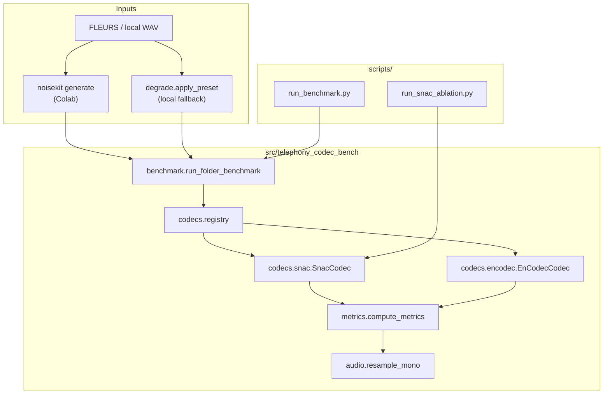

# Project design: telephony-codec-bench

How the code is laid out and why. For install and a quick run, see [README.md](../README.md).

---

## The question

Voice products often tokenize speech that already went through a phone line: narrowband, companded, maybe noisy. Codec papers usually test clean 24 kHz audio. We degrade first, run SNAC or EnCodec round-trip, then score:

> What survives the codec, and how do STOI, PESQ, SNR, and latency compare?

---

## Design choices

1. **Core library, thin scripts.** Benchmark logic lives in `src/telephony_codec_bench/`. Colab and CLI just call into it.
2. **One codec interface.** Every codec exposes `roundtrip(wav, sr) → (recon, stats)`. The benchmark loop does not care whether you are on SNAC or EnCodec.
3. **Two ways to feed data.** Local runs can degrade on the fly with `degrade.py`. Colab uses pre-built noisekit WAVs plus `metadata.jsonl`. Same inner loop either way.
4. **Metrics at an explicit sample rate.** Codecs run at 24 kHz. Telephony scoring is opt-in: `--eval-sr 8000 --pesq-mode nb`. No silent resampling inside STOI/PESQ.
5. **Colab pipeline is one script.** MUSAN prefetch, noisekit generate, and the GPU benchmark chain together with logged subprocess steps.

---

## Architecture



---

## Data flow

### 1. Degradation

| Path | Entry point | What it does |
|------|-------------|--------------|
| Colab | `noisekit generate` (see [COLAB.md](./COLAB.md)) | FLEURS `en_us` test, 3 presets per utterance (`clean_reference`, `telecom`, `noise_telecom`). MUSAN noise on `noise_telecom`. Writes `data/telephony_speech/` and `metadata.jsonl`. |
| Local | `degrade.apply_preset()` | Lightweight PSTN stand-in: 8 kHz bandpass (300-3400 Hz), μ-law, upsample. Optional 10 dB noise before telecom on `noise_telecom`. |

Preset names match noisekit so local and Colab numbers stay comparable.

### 2. Codec round-trip

For each `(wav, preset)`:

1. Load mono float32.
2. For each codec (`snac_24khz`, `encodec_24khz`):
   - Resample to 24 kHz inside the wrapper.
   - Encode to tokens, decode back to waveform.
   - Record `encode_ms`, `decode_ms`, token counts.

The reference is the **degraded** clip, not the original clean FLEURS audio. We measure extra damage from the codec on top of the phone channel.

### 3. Metrics

`compute_metrics(ref, recon, codec_sr, ...)`:

1. Optionally resample both to `eval_sr` (8000 for narrowband).
2. **SNR** in that band.
3. **STOI** via `pystoi` at `metric_sr`.
4. **PESQ** (optional): resample to 8 kHz (nb) or 16 kHz (wb), then call `pesq()`. Pipeline uses `nb` with `--eval-sr 8000`.

Early runs scored PESQ at 24 kHz and got `null` for every sample. Fix: pass `--eval-sr 8000 --pesq-mode nb`.

### 4. Aggregation

`BenchmarkReport` rolls up per-sample rows into means by `(codec, preset)`. `run_benchmark.py` writes JSON and CSV.

---

## Module map

```
src/telephony_codec_bench/
├── cli.py              # telephony-codec-bench entry point
├── benchmark.py        # run_folder_benchmark, noisekit manifest, reports
├── degrade.py          # Preset enum + local degradation
├── metrics.py          # SNR, STOI, PESQ (eval_sr / pesq_mode)
├── audio.py            # torchaudio resample helper
├── cpu_limits.py       # thread caps for laptop runs
└── codecs/
    ├── base.py         # RoundtripStats + CodecRoundtrip Protocol
    ├── registry.py     # lazy discovery + get_codec(name)
    ├── snac.py         # hubertsiuzdak/snac_24khz, coarse_only ablation
    └── encodec.py      # facebook/encodec_24khz via HuggingFace

scripts/
├── run_benchmark.py           # main GPU driver
├── run_snac_ablation.py       # SNAC full vs coarse-only (optional)
├── verify_colab_env.py        # dependency smoke test
└── compat_audit.py            # manifest checker (used by verify_colab_env)
```

---

## Codec layer

### Protocol (`codecs/base.py`)

```python
class CodecRoundtrip(Protocol):
    name: str
    sample_rate: int
    def roundtrip(self, wav, sample_rate) -> tuple[np.ndarray, RoundtripStats]: ...
```

To add a codec: implement this, register in `registry.get_codec()`, guard imports in `available_codecs()`.

### SNAC (`codecs/snac.py`)

- Checkpoint: `hubertsiuzdak/snac_24khz`.
- `encode()` returns one code tensor per scale.
- `coarse_only`: keep the coarsest scale, zero the rest. Used by `run_snac_ablation.py`.

### EnCodec (`codecs/encodec.py`)

- Checkpoint: `facebook/encodec_24khz` via `EncodecModel` + `AutoProcessor`.
- HF processor wants 1-D mono float32, not `(1, samples)`.

### Registry (`codecs/registry.py`)

Lazy imports so `pip install -e .` works without torch. The `[bench]` extra pulls SNAC, transformers, noisekit, pesq, and the rest.

---

## Benchmark loop (`benchmark.py`)

| Mode | When | Behavior |
|------|------|----------|
| noisekit | `metadata.jsonl` present | Each line gives `(path, preset)`. No runtime degradation. |
| flat folder | no manifest | Every `*.wav` × every preset, degraded with `apply_preset(..., seed=hash(filename))`. |

Per sample:

```
degraded wav → for each codec:
                 recon, stats = codec.roundtrip(degraded, sr)
                 metrics = compute_metrics(ref=degraded, recon, ...)
                 append SampleResult
```

`max_samples` caps at 50 for smoke tests or 200 for the full run.

---

## Metrics (`metrics.py`)

| Metric | Why we track it |
|--------|-----------------|
| STOI | Intelligibility. Main gap on telecom (~+0.02 for SNAC in our run). |
| PESQ | Perceptual quality. Can disagree with STOI under noise. Needs the right nb/wb rate. |
| SNR | Cheap reconstruction error, no extra deps. |
| encode/decode ms | Latency on GPU via `perf_counter`. |

`eval_sr` splits **where the codec runs** (24 kHz) from **where you score** (8 kHz for phone-band eval).

---

## Scripts

### `run_benchmark.py`

```sh
python scripts/run_benchmark.py \
  --data-dir ./data/telephony_speech \
  --device cuda \
  --max-samples 200 \
  --eval-sr 8000 \
  --pesq --pesq-mode nb \
  --out reports/benchmark_200.json
```

Writes a matching `.csv` summary.

### `run_snac_ablation.py`

Runs SNAC full vs coarse-only per WAV. Output: `reports/snac_ablation.json`. Not part of the default 200-sample report yet.

### CLI (`telephony-codec-bench`)

Quick local check: fewer presets, CPU by default, PESQ only with `--pesq`.

---

## Dependencies (`pyproject.toml`)

| Extra | Packages |
|-------|----------|
| core | numpy, scipy, soundfile |
| `metrics` | pystoi |
| `bench` | torch, snac, transformers/encodec, datasets, noisekit, pesq, tqdm, librosa |

Colab pins are in `docs/colab-requirements.txt`. Install torch from the notebook cell, not PyPI.

---

## Extension points

**New codec:** file under `codecs/`, register, pass `--codec name`.

**New preset:** extend `degrade.Preset`, mirror the name in noisekit, add to script `--preset` lists.

**New metric:** extend `MetricResult` and `compute_metrics()`, update CSV columns in `run_benchmark.py`.

| Eval goal | Flags |
|-----------|-------|
| Paper-like @ 24 kHz | default (no `eval_sr`) |
| Phone-band | `--eval-sr 8000 --pesq-mode nb` |
| Wideband PESQ | `--pesq-mode wb` |

---

## Reports

| Path | Contents |
|------|----------|
| `data/telephony_speech/` | noisekit WAVs + `metadata.jsonl` |
| `reports/benchmark_*.json` | per-sample rows + summary |
| `reports/benchmark_*.csv` | summary only |
| `reports/baseline/` | first run @ 24 kHz, PESQ null |
| `reports/baseline_pesq/` | 8 kHz nb eval (reference numbers) |

JSON shape: `samples[]` with `{preset, codec, source, snr_db, stoi, pesq, stats}`; `summary` keyed by `codec|preset`.

---

## Out of scope

- Training or fine-tuning (inference only).
- ASR-WER (possible follow-up beside `compute_metrics`).
- Streaming RTF (we time whole-utterance encode/decode, not chunked streaming).
- Bitrate sweeps (fixed public checkpoints only).

The repo is an eval harness for phone-degraded speech, not a codec training framework.

---

## Related docs

| Doc | Contents |
|-----|----------|
| [README.md](../README.md) | Install, pipeline diagram |
| [COLAB.md](./COLAB.md) | Colab cells and pins |
