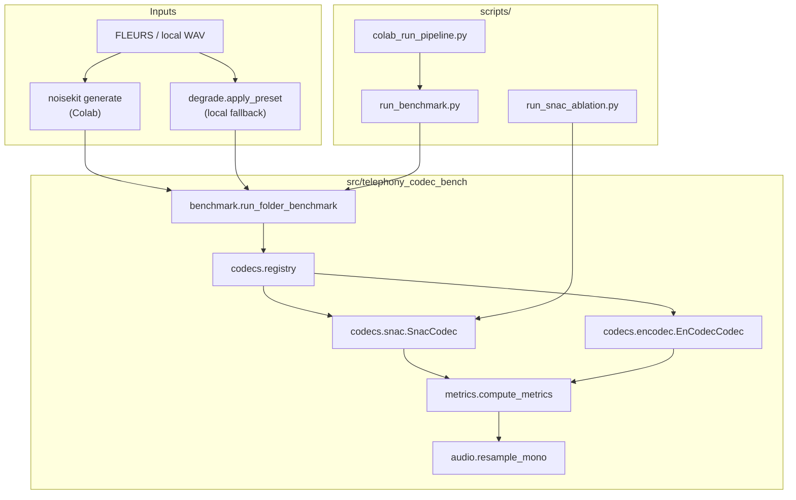

# Project design: telephony-codec-bench

How the code is organized, what each layer does, and why it is built this way. For install and quick start, see [README.md](../README.md).

---

## Question the code answers

Enterprise voice stacks often run **neural audio tokenizers** (SNAC-style multi-scale RVQ) on speech that already went through a **phone channel** (narrowband, companding, background noise). Papers usually benchmark codecs on **clean** speech at **24 kHz**. This project measures:

> After telephony-style degradation, what survives a **codec round-trip** (encode → decode), and how do **STOI**, **PESQ**, **SNR**, and **latency** trade off between SNAC and EnCodec?

The benchmark is deliberately **downstream of the channel**: degrade first, then codec, then score.

---

## Design principles

1. **Thin core, fat drivers.** All science logic lives in `src/telephony_codec_bench/`. Colab and CLI are thin wrappers (`scripts/`, `docs/`).
2. **One round-trip interface.** Every codec implements the same `roundtrip(wav, sr) → (recon, stats)` contract. Benchmark code never branches on SNAC vs EnCodec internals.
3. **Two data paths, one benchmark loop.** Local dev can degrade on the fly (`degrade.py`). Colab uses pre-generated **noisekit** WAVs + `metadata.jsonl`. Both feed the same `_benchmark_wav()` path.
4. **Explicit metric domain.** Codecs run at 24 kHz; telephony scoring is opt-in via `--eval-sr 8000 --pesq-mode nb`. Metrics resample before STOI/PESQ so rates are never implicit.
5. **Reproducible heavy runs on Colab.** Data generation (FLEURS + noisekit + MUSAN prefetch) and GPU benchmark are orchestrated by one pipeline script with logged subprocess steps.

---

## Architecture



---

## End-to-end data flow

### 1. Degradation (channel simulation)

| Path | Where | What happens |
|------|-------|--------------|
| **Colab / full benchmark** | `noisekit generate` via `colab_run_pipeline.py` | FLEURS `en_us` test split → 3 presets per utterance: `clean_reference`, `telecom`, `noise_telecom`. MUSAN ambient noise for `noise_telecom`. Output: `data/telephony_speech/` + `metadata.jsonl`. |
| **Local / unit-style** | `degrade.apply_preset()` | Simpler PSTN-ish chain: 8 kHz bandpass (300–3400 Hz), μ-law companding, upsample back. Optional 10 dB AWGN before telecom for `noise_telecom`. |

Presets are an enum in `degrade.Preset`. Names match noisekit so reports are comparable across paths.

### 2. Codec round-trip

For each `(wav, preset)` row:

1. Load mono float32 waveform.
2. For each registered codec (`snac_24khz`, `encodec_24khz`):
   - Resample input to codec native rate (24 kHz) inside the codec wrapper.
   - **Encode** → discrete codes/tokens.
   - **Decode** → reconstructed waveform at 24 kHz.
   - Record `encode_ms`, `decode_ms`, token counts.

Reference is the **degraded** waveform (not the original clean FLEURS clip). We measure how much the codec damages speech that is already phone-quality.

### 3. Metrics

`compute_metrics(ref, recon, codec_sr, ...)`:

1. Optionally resample both to `eval_sr` (e.g. **8000** for narrowband telephony eval).
2. **SNR**: always computed in the metric domain.
3. **STOI**: `pystoi` at `metric_sr`.
4. **PESQ** (optional): resample to 8 kHz (nb) or 16 kHz (wb) before calling `pesq()`. Mode controlled by `--pesq-mode`; pipeline uses `nb` with `--eval-sr 8000`.

Important: scoring at 24 kHz with `--pesq` silently returned `null` for every sample until `eval_sr` and `pesq_mode` were wired correctly. Use `--eval-sr 8000 --pesq-mode nb` for telephony eval.

### 4. Aggregation

`BenchmarkReport` collects per-sample rows and builds a **summary** keyed by `(codec, preset)`: means of STOI, PESQ, SNR, encode/decode latency. `run_benchmark.py` writes JSON + CSV.

---

## Module map

```
src/telephony_codec_bench/
├── cli.py              # telephony-codec-bench entry point (folder benchmark, stdout)
├── benchmark.py        # run_folder_benchmark, noisekit manifest, SampleResult / BenchmarkReport
├── degrade.py          # Preset enum + local telephony degradation
├── metrics.py          # SNR, STOI, PESQ with eval_sr / pesq_mode
├── audio.py            # torchaudio resample helper
├── cpu_limits.py       # OMP/MKL/torch thread caps for laptop-friendly runs
└── codecs/
    ├── base.py         # RoundtripStats + CodecRoundtrip Protocol
    ├── registry.py     # lazy discovery + get_codec(name)
    ├── snac.py         # hubertsiuzdak/snac_24khz; coarse_only ablation hook
    └── encodec.py      # facebook/encodec_24khz via HuggingFace transformers

scripts/
├── run_benchmark.py           # primary GPU driver → reports/*.json + .csv
├── colab_run_pipeline.py      # MUSAN prefetch → noisekit → run_benchmark
├── colab_prefetch_musan.py    # cache 20 MUSAN clips for noisekit --noise-dir
├── run_snac_ablation.py       # SNAC full vs coarse-only (multi-scale hypothesis)
├── verify_colab_env.py        # smoke-check torch, codecs, metrics deps
└── colab_remote_setup.py      # VM bootstrap helper
```

---

## Codec layer

### Protocol (`codecs/base.py`)

```python
class CodecRoundtrip(Protocol):
    name: str
    sample_rate: int
    def roundtrip(self, wav, sample_rate) -> tuple[np.ndarray, RoundtripStats]: ...
```

Benchmark code only depends on this interface. Adding a codec means: implement the protocol, register in `registry.get_codec()`, optional dependency guard in `available_codecs()`.

### SNAC (`codecs/snac.py`)

- Model: `SNAC.from_pretrained("hubertsiuzdak/snac_24khz")`.
- Multi-scale codes: `encode()` returns a list of code tensors per scale.
- **`coarse_only` ablation**: decode with coarsest scale only, zero fine scales. Used by `run_snac_ablation.py` to test whether intelligibility lives in coarse tokens under noise.

### EnCodec (`codecs/encodec.py`)

- Model: `EncodecModel.from_pretrained("facebook/encodec_24khz")` + `AutoProcessor`.
- Single-stack RVQ baseline at similar nominal bitrate family.
- HF API quirk: processor expects 1-D mono float32, not `(1, samples)`.

### Registry (`codecs/registry.py`)

Lazy imports so `pip install -e .` (core deps only) works without torch. Full bench extras (`[bench]`) pull SNAC, transformers, noisekit, pesq, etc.

---

## Benchmark loop (`benchmark.py`)

Two input modes, one inner loop `_benchmark_wav()`:

| Mode | Trigger | Behavior |
|------|---------|----------|
| **noisekit** | `data_dir/metadata.jsonl` exists | Each line → `(path, preset)`. Presets come from manifest; no runtime `apply_preset`. |
| **flat folder** | no manifest | Every `*.wav` × every requested preset; degrade via `apply_preset(..., seed=hash(filename))`. |

Inner loop per sample:

```
degraded wav → for codec in codecs:
                 recon, stats = codec.roundtrip(degraded, sr)
                 ref_metrics = resample(degraded → codec_sr or eval_sr)
                 metrics = compute_metrics(ref_metrics, recon, ...)
                 append SampleResult
```

`max_samples` truncates manifest rows or WAV list for smoke tests (50) vs full run (200).

---

## Metrics design (`metrics.py`)

| Metric | Role in this project |
|--------|----------------------|
| **STOI** | Intelligibility proxy; primary ranker for telecom STOI gap (SNAC ~+0.02). |
| **PESQ** | Perceptual quality; exposes STOI/PESQ divergence under noise. Requires correct nb/wb sample rate. |
| **SNR** | Simple reconstruction error; always available, no extra deps. |
| **encode/decode ms** | Streaming TTS relevance; measured inside codec with `perf_counter` on GPU. |

`eval_sr` decouples **codec operating rate** from **evaluation band**. Default (None) scores at codec native rate; telephony pipeline sets `8000` so STOI and PESQ reflect what a narrowband listener would hear.

---

## Scripts and Colab pipeline

### `run_benchmark.py`

Canonical entry for numbered results. Flags that matter:

```sh
python scripts/run_benchmark.py \
  --data-dir ./data/telephony_speech \
  --device cuda \
  --max-samples 200 \
  --eval-sr 8000 \
  --pesq --pesq-mode nb \
  --out reports/benchmark_200.json
```

Writes paired `.csv` summary. Used directly and from the Colab pipeline.

### `colab_run_pipeline.py`

Sequential subprocess orchestration:

1. **`colab_prefetch_musan.py`** (20 clips, idempotent cache)
2. **`noisekit generate`** (FLEURS, 3 presets, `--noise-dir` MUSAN cache)
3. **`run_benchmark.py`** with telephony eval flags

`--skip-generate` / `--skip-benchmark` for partial reruns. Known failure mode: streaming HF dataset hang after prefetch (Case 1 in interview notes).

### `run_snac_ablation.py`

Separate from main benchmark: for each WAV, runs SNAC **full** vs **coarse_only**, writes `reports/snac_ablation.json`. Not yet part of the standard 200-sample report; planned validation for multi-scale vs noise hypothesis.

### CLI (`telephony-codec-bench`)

Lighter wrapper around `run_folder_benchmark` for quick local checks. Defaults to fewer presets (`clean_reference`, `telecom`), CPU, no PESQ unless `--pesq`.

---

## Dependencies (`pyproject.toml`)

| Extra | Purpose |
|-------|---------|
| *(core)* | numpy, scipy, soundfile only |
| `metrics` | pystoi |
| `bench` | torch, snac, transformers/encodec, datasets, noisekit, pesq, tqdm, librosa |

Colab pins versions in `docs/colab-requirements.txt` (do not install torch from PyPI on Colab; use the notebook cell).

---

## Extension points

### Add a codec

1. New file under `codecs/` implementing `roundtrip`.
2. Register name in `registry.get_codec()` and `available_codecs()`.
3. Pass `--codec your_name` to `run_benchmark.py`.

### Add a degradation preset

1. Extend `degrade.Preset` and `apply_preset()` for local path.
2. Add matching noisekit preset name for Colab (must match string in manifest).
3. Include in `--preset` lists in scripts.

### Add a metric

Extend `MetricResult` and `compute_metrics()`. Keep resampling inside metrics so callers stay dumb. Update CSV fieldnames in `run_benchmark.py` if summary-level.

### Telephony vs wideband eval

| Goal | Flags |
|------|-------|
| Paper-like @ 24 kHz | default (`eval_sr` unset) |
| Phone-agent narrative | `--eval-sr 8000 --pesq-mode nb` |
| Wideband PESQ | `--pesq-mode wb` (16 kHz) |

---

## Artifacts and reports

| Path | Contents |
|------|----------|
| `data/telephony_speech/` | noisekit WAVs + `metadata.jsonl` |
| `reports/benchmark_*.json` | full per-sample + summary |
| `reports/benchmark_*.csv` | summary table only |
| `reports/baseline/` | first run @ 24 kHz, null PESQ |
| `reports/baseline_pesq/` | telephony-correct eval (reference numbers) |

JSON schema: `samples[]` with `{preset, codec, source, snr_db, stoi, pesq, stats}`; `summary` keyed by `codec|preset`.

---

## What this code deliberately does not do

- **No training or fine-tuning.** Inference-only round-trip.
- **No ASR-WER yet.** Mentioned in literature doc as a follow-up; would sit beside `compute_metrics`.
- **No real-time streaming simulation.** Latency is per-utterance encode/decode, not chunked streaming RTF.
- **No codec bitrate sweeps.** Fixed public checkpoints (`snac_24khz`, `encodec_24khz`).

These boundaries keep the repo a focused **eval harness** for phone-degraded speech, not a general codec training framework.

---

## Related docs

| Doc | Focus |
|-----|-------|
| [README.md](../README.md) | Install, one-command benchmark, pipeline diagram |
| [COLAB.md](./COLAB.md) | Colab step-by-step, pinned deps |
| [COLAB_CLI.md](./COLAB_CLI.md) | Remote VM CLI workflow |
